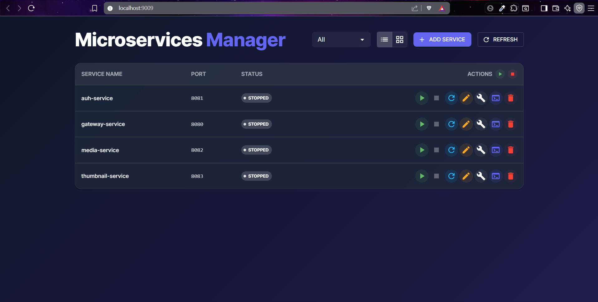
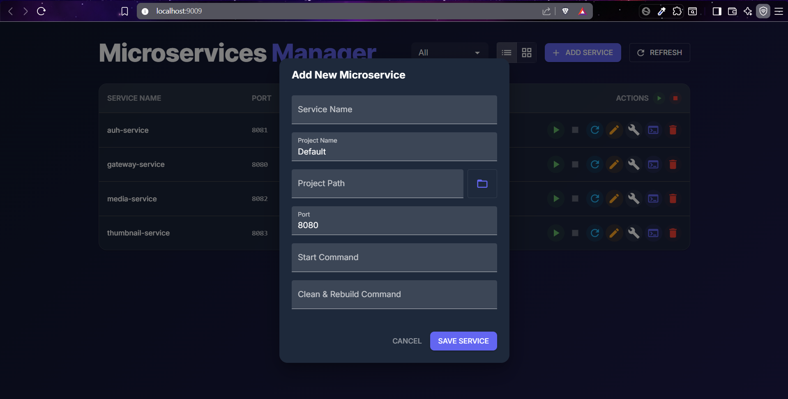
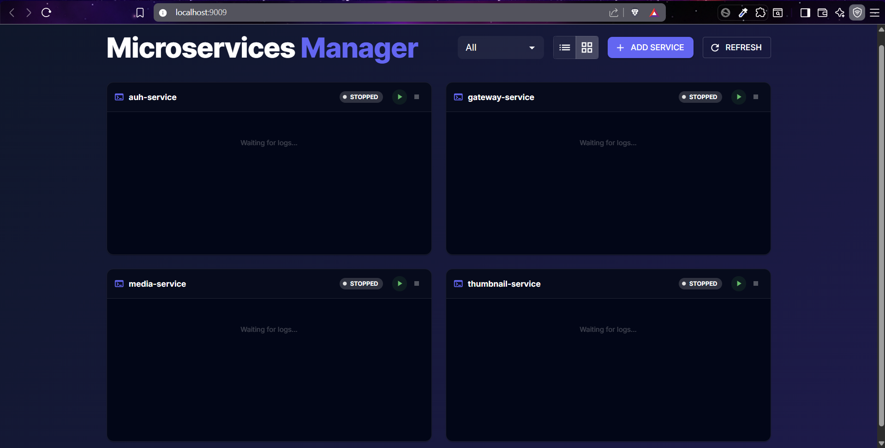

# Microservices Manager

A powerful dashboard to manage your microservices without Docker.

## 🚀 Getting Started

### 1. Configuration
Define your services in `services.json` at the root of the project.

```json
{
  "services": [
    {
      "name": "example-service",
      "path": "D:/projects/my-service",
      "port": 8080,
      "startCommand": "mvn spring-boot:run"
    }
  ]
}
```

### 2. Run Backend
Go to the `backend` folder and run:
`mvn spring-boot:run`
(Alternatively: `java -jar target/manager-0.0.1-SNAPSHOT.jar`)

### 3. Run Frontend
Go to the `frontend` folder and run:
`npm run dev`

Access the UI at: `http://localhost:3000`

## 🛠 Features
- **Start/Stop/Restart**: Manage service lifecycle.
- **Live Logs**: Streaming logs via SSE.
- **Health Monitoring**: Visual indicators for service status.
- **Rebuild**: Trigger Maven builds from the UI.

## 🏗 Stack
- **Backend**: Spring Boot 3, Java 17+, Maven, Actuator
- **Frontend**: React, Vite, MUI, Framer Motion

## 🏗 Example
- **Screenshots**:



